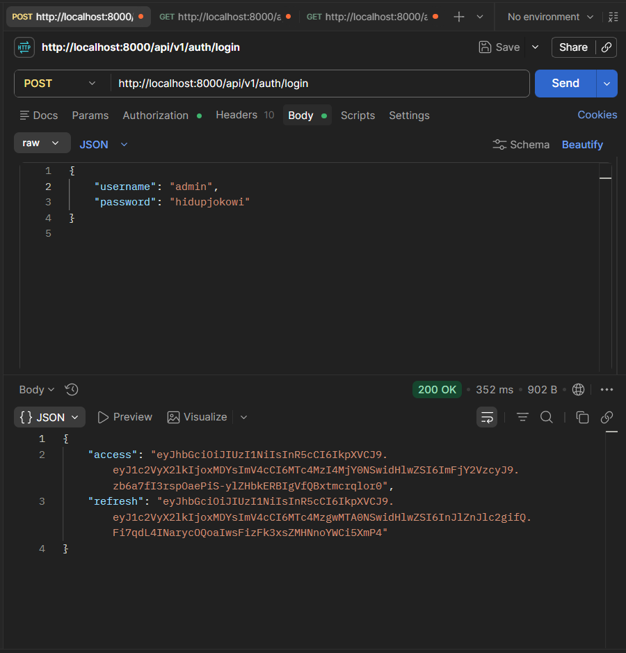
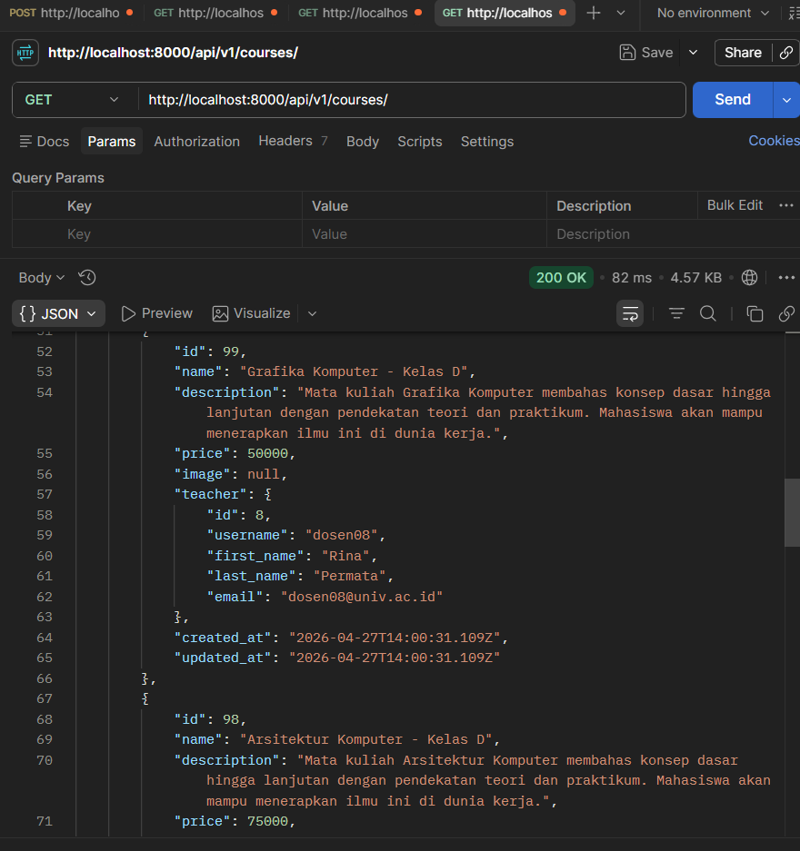
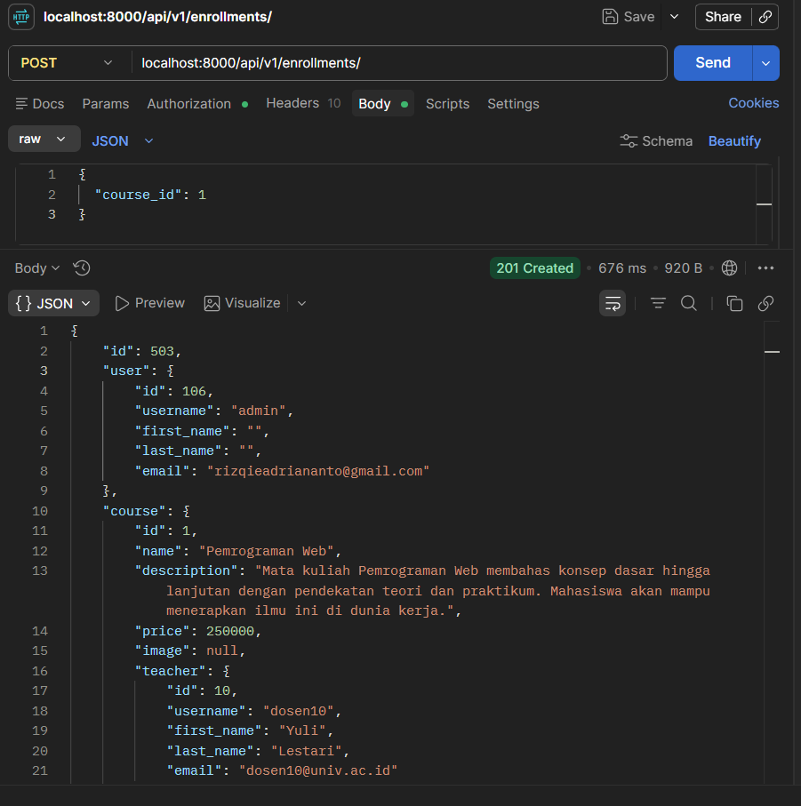

# Laporan Final Project: Simple Learning Management System (LMS)

## 1. Identitas
- **Nama:** Rizqie Adri Ananto
- **NIM:** A11.2023.15187
- **Kelas:** A11.4602
- **URL Repository:** https://github.com/ancient03/project-simple-lms-adri

## 2. Deskripsi Project
Project ini adalah sistem manajemen pembelajaran (LMS) berbasis *backend* menggunakan arsitektur **Django Ninja**. Sistem ini dirancang secara modern agar dapat menyediakan fitur kursus secara komprehensif mulai dari pendaftaran siswa, pengelolaan materi kelas oleh pengajar, pelacakan progres, pengujian kompetensi kuis, hingga penerbitan sertifikat digital. Semua servis aplikasi dibangun di atas arsitektur *microservice* dan siap beroperasi di lingkungan *production* (Docker).

## 3. Fitur Dasar yang Sudah Berjalan
Berdasarkan persyaratan basis project minimal, fitur-fitur berikut telah diimplementasikan 100% dan berjalan sempurna:
1. **Authentication JWT:** Pendaftaran & Login token (Access & Refresh token).
2. **Role-Based Access Control (RBAC):** Pemisahan hak akses nyata antara Admin, Instructor (Teacher), dan Student.
3. **Course API:** CRUD Kursus (*Course*) dan Konten Materi (*Lesson*).
4. **Enrollment API:** Endpoint pendaftaran siswa ke dalam sebuah kelas.
5. **Progress API:** Pelacakan sejauh mana siswa menuntaskan konten kelas.
6. **Containerization:** Berjalan sepenuhnya di atas arsitektur *Docker Compose* dengan basis database PostgreSQL.

## 4. Fitur Tambahan yang Dipilih
Untuk memperluas skala aplikasi, saya mengimplementasikan 2 paket fitur canggih sekaligus:

| No | Fitur | Kategori Paket | Poin Maksimal | Status |
|----|-------|----------------|---------------|--------|
| 1. | **Quiz & Question Bank** | Paket 3 (Assessment & Cert) | 15 | ✅ Selesai |
| 2. | **Scoring Otomatis** | Paket 3 (Assessment & Cert) | 15 | ✅ Selesai |
| 3. | **Attempt Limit & Passing Grade** | Paket 3 (Assessment & Cert) | 15 | ✅ Selesai |
| 4. | **Certificate Generation** | Paket 3 (Assessment & Cert) | 15 | ✅ Selesai |
*(Total nilai fitur tambahan yang diimplementasikan bernilai 60 Poin).*

## 5. Penjelasan Implementasi
- **Paket 3 (Assessment & Certificate):** Saya menambahkan 5 tabel relasional baru (`Quiz`, `Question`, `Choice`, `QuizAttempt`, dan `Certificate`). Ketika *student* mencoba mengirimkan jawaban API, *backend* saya akan otomatis mencocokkan *array ID* jawaban dengan `is_correct` di tabel pilihan ganda. Sistem mencegah siswa ikut kuis lebih dari batas *Attempt Limit*, dan siswa hanya bisa mendapatkan sertifikat dengan UUID *randomized* otentik apabila nilainya menyentuh *Passing Grade* yang diatur oleh instruktur.

## 6. Cara Menjalankan Project
Proses *deployment* dikemas ringkas menggunakan docker:
1. *Clone* repository.
2. Atur *Environment Variables* di dalam file `.env`.
3. Jalankan perintah terminal:
   ```bash
   docker compose up --build -d
   ```
4. Lakukan migrasi database (jika baru pertama kali):
   ```bash
   docker compose exec app python manage.py migrate
   docker compose exec app python manage.py seed_data
   ```

## 7. Akun Demo
| Role | Username | Password | Keterangan |
|------|----------|----------|------------|
| Admin | `admin` | `admin123` | Akses mutlak / Superuser |
| Teacher | `dosen10` | `admin123` | Instruktur (Pemilik Course ID 1) |
| Student | `mhs001` | `password123` | Siswa pendaftar kursus & Kuis |

## 8. Endpoint
### Authentication
| Method | Endpoint | Deskripsi |
|---|---|---|
| `POST` | `/api/v1/auth/login` | Login untuk mengambil Bearer JWT |
| `POST` | `/api/v1/auth/register` | Register untuk membuat akun baru |
| `GET` | `/api/v1/auth/me` | Mendapatkan informasi user |

### Course
| Method | Endpoint | Deskripsi |
|---|---|---|
| `GET` | `/api/v1/courses/` | Menampilkan daftar course |
| `GET` | `/api/v1/courses/{id}` | Menampilkan detail course |
| `POST` | `/api/v1/courses/` | Membuat course (Admin, Teacher) |
| `PUT` | `/api/v1/courses/{id}` | Mengupdate course (Admin, Teacher) |
| `DELETE` | `/api/v1/courses/{id}` | Menghapus course (Admin) |
| `POST` | `/api/v1/courses/{id}/visit` | Mencatat course yang dikunjungi ke dalam session. |
| `GET` | `/api/v1/my-history/` | Menampilkan daftar course yang pernah dikunjungi dari session |
| `POST` | `/api/v1/courses/{id}/upload-image/` | Upload gambar course (Admin, Teacher) |
| `GET` | `/api/v1/courses/popular/` | Menampilkan daftar course terpopuler |

### Enrollments
| Method | Endpoint | Deskripsi |
|---|---|---|
| `POST` | `/api/v1/enrollments/` | Mendaftarkan siswa ke dalam course (Student) |
| `GET` | `/api/v1/enrollments/my-courses` | Menampilkan daftar course yang terdaftar |

### Course Contents
| Method | Endpoint | Deskripsi |
|---|---|---|
| `GET` | `/api/v1/contents/` | Menampilkan daftar konten dengan filtering, sorting, dan pagination. |
| `PATCH` | `/api/v1/contents/{id}/` | Partial update course contents. |
| `GET` | `/api/v1/contents/{id}/download/` | Download course contents. |
| `POST` | `/api/v1/contents/{id}/upload-attachment/` | Upload course contents. |

### Reports
| Method | Endpoint | Deskripsi |
|---|---|---|
| `POST` | `/api/v1/reports/generate/{course_id}/` | Generate report |
| `GET` | `/api/v1/reports/status/{task_id}/` | Cek status report |

### Progress
| Method | Endpoint | Deskripsi |
|---|---|---|
| `GET` | `/api/v1/progress/` | Mendapatkan daftar progress belajar user. |
| `POST` | `/api/v1/progress/` | Menandai lesson (CourseContent) telah selesai atau belum. |

### Analytics
| Method | Endpoint | Deskripsi |
|---|---|---|
| `POST` | `/api/v1/analytics/log/` | Mencatat aktivitas user ke MongoDB. |
| `GET` | `/api/v1/analytics/popular-courses/` | Mengambil daftar course terpopuler berdasarkan views. |
| `GET` | `/api/v1/analytics/my-activity/` | Mengambil ringkasan aktivitas user yang sedang login. |
| `GET` | `/api/v1/analytics/daily-summary/` | Mengambil ringkasan aktivitas harian. |
| `GET` | `/api/v1/analytics/top-users/` | Mengambil user paling aktif. |


### Quiz 
| Method | Endpoint | Deskripsi |
|---|---|---|
| `POST` | `/api/v1/quizzes/` | Membuat kuis (Teacher) |
| `POST` | `/api/v1/quizzes/{id}/questions/` | Menambah soal kuis (Teacher) |
| `GET` |  `/api/v1/quizzes/{quiz_id}/` | Menampilkan detail kuis |
| `POST` | `/api/v1/quizzes/{id}/submit/` | Menjawab kuis dengan *auto-scoring* (Student) |

### Sertifikat
| Method | Endpoint | Deskripsi |
|---|---|---|
| `POST` | `/api/v1/certificates/generate/{course_id}/` | Mengecek kelulusan dan menerbitkan sertifikat (Student). |
| `GET` | `/api/v1/certificates/{uuid}/` | Menampilkan Sertifikat yang ada|

## 9. Screenshot / Bukti Pengujian 
 (Menggunakan Postman)

1. **Login  &  Auth JWT**



2. **Course & Enrollment API**





3. **[Screenshot 3: Teacher Membuat Kuis (RBAC)]**
   - *Ganti token menggunakan akun `dosen10` (Instruktur).*
   - *Tunjukkan request POST `/quizzes/` berhasil (HTTP 201) membuat Kuis Ujian Akhir untuk Course ID 1.*
   - *Tunjukkan request POST `/quizzes/{id}/questions/` berhasil menambahkan pertanyaan.*
4. **[Screenshot 4: Siswa Mengerjakan Kuis & Auto Scoring]**
   - *Ganti token menggunakan akun `mhs001` (Siswa).*
   - *Tunjukkan request GET `/quizzes/{id}`. Sorot bagian Response yang membuktikan bahwa field `is_correct` dari server berhasil DISAMARKAN/DIHILANGKAN agar siswa tidak curang.*
   - *Tunjukkan request POST `/quizzes/{id}/submit/` dengan payload jawaban. Sorot hasil responsenya yang menunjukkan `score: 100`, dan `passed: True`.*
5. **[Screenshot 5: Certificate Generation]**
   - *Ganti token menggunakan akun `mhs001` (Siswa).*
   - *Tunjukkan request POST `/certificates/generate/1/`.*
   - *Sorot bagian responsenya yang berhasil memberikan kode ID Sertifikat unik berupa `UUID`.*

## 10. Kendala dan Solusi
1. **Kendala Database Schema Mismatch:** Di pertengahan pengembangan, fitur *seeder* (`seed_data.py`) gagal dieksekusi karena ada ketidaksesuaian relasi *(ForeignKey mapping)* yang sebelumnya menggunakan `roles varchar(3)`. 
   **Solusi:** Saya merombak paksa struktur migrasi dan memberikan *Alter Table* langsung melalui kueri SQL. Selain itu, logika `seed_data.py` direstrukturisasi (seperti mengganti string `'std'` menjadi `'student'`) sehingga data bawaan (dummy) bisa ditanam dengan sukses sesuai arsitektur yang baru.

## 11. Kesimpulan
Membangun Simple LMS ini memberikan saya gambaran nyata tentang bagaimana cara menyatukan *puzzle* pengembangan *backend* modern (seperti Django Ninja, JWT Authentication, serta arsitektur Microservice Docker). Tantangan dalam merancang algoritma Kuis dan perhitungan nilai (*Scoring*) berhasil dipecahkan, membuktikan bahwa proyek ini sangat aplikatif dan fungsional.
