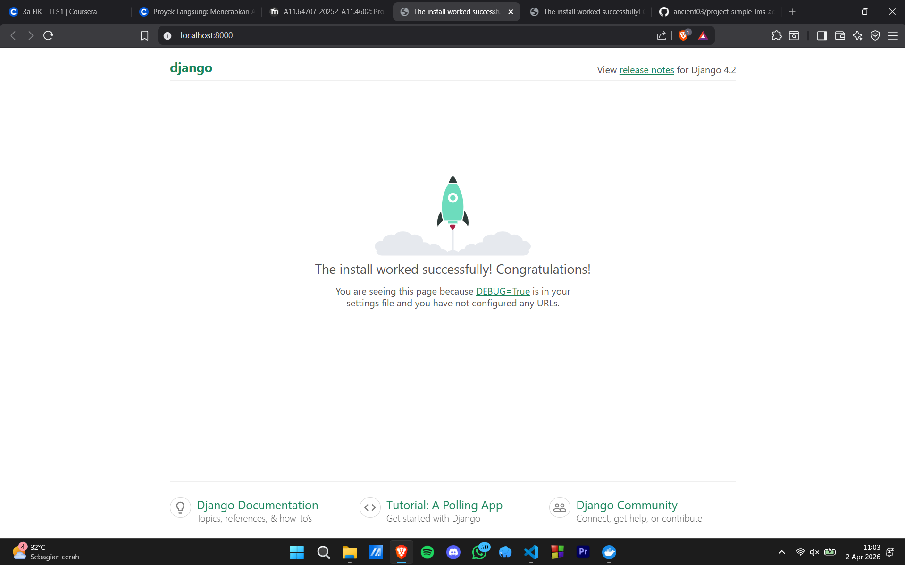

# 📚 Simple Learning Management System (LMS) - Project Documentation

Project **Simple LMS** dikembangkan menggunakan **Django 4.2** dan **PostgreSQL 15** dengan arsitektur *containerization* menggunakan **Docker**. Dokumentasi ini menyatukan semua instruksi dan file konfigurasi dalam satu tempat.

Nama    : Rizqie Adri Ananto

NIM : A11.2023.15187

---

## 1. Cara Menjalankan Project (Quick Start)

Ikuti langkah-langkah berikut di terminal:

1.  **Build dan Jalankan Container**:
    ```bash
    docker compose up -d --build
    ```
2.  **Jalankan Migrasi Database**:
    ```bash
    docker compose exec web python manage.py migrate
    ```
3.  **Buat Akun Administrator**:
    ```bash
    docker compose exec web python manage.py createsuperuser
    ```
4.  **Akses Aplikasi**:
    - **Web App**: [http://localhost:8000](http://localhost:8000)
    - **Django Admin**: [http://localhost:8000/admin](http://localhost:8000/admin)

---

## 2. Environment Variables Explanation (.env)

| Variabel | Penjelasan | Contoh Value |
| :--- | :--- | :--- |
| DEBUG | Mode pengembangan (1=On, 0=Off) | 1 |
| SECRET_KEY | Key rahasia untuk keamanan Django | django-insecure-adri-lms-2026 |
| DB_NAME | Nama database di PostgreSQL | simple_lms_adri |
| DB_USER | Username login database | adri |
| DB_PASSWORD | Password login database | admin123hidupadmin |
| DB_HOST | Nama service database di Docker | db |
| DB_PORT | Port default PostgreSQL | 5432 |

---

## 📸 3. Screenshot Django Welcome Page


---
