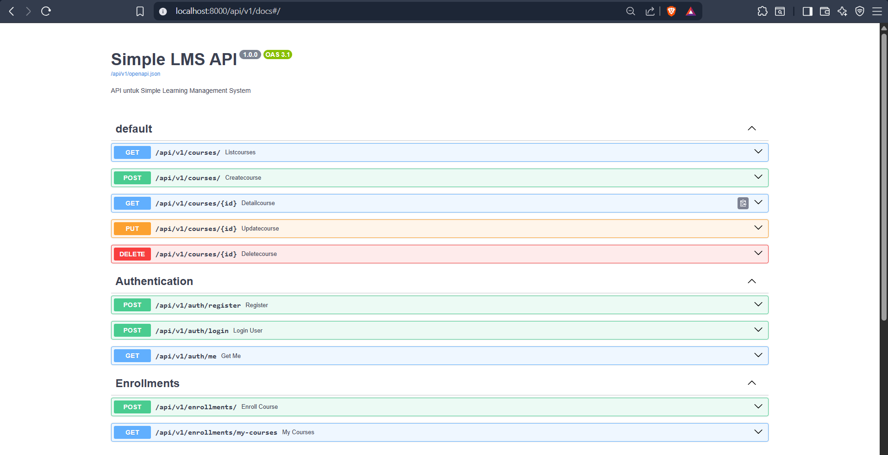
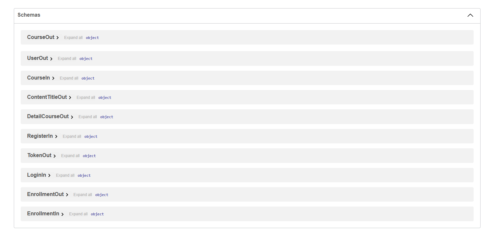

# 📚 Simple Learning Management System (LMS) - Project Documentation

Project **Simple LMS** dikembangkan menggunakan **Django 4.2** dan **PostgreSQL 15** dengan arsitektur *containerization* menggunakan **Docker**. Dokumentasi ini menyatukan semua instruksi dan file konfigurasi dalam satu tempat.

Nama    : Rizqie Adri Ananto

NIM : A11.2023.15187

---

## 1. Cara Menjalankan Project (Quick Start)

Ikuti langkah-langkah berikut di terminal:

1.  **Build dan Jalankan Container**:
    ```bash
    docker compose up -d --build
    ```
2.  **Jalankan Migrasi Database**:
    ```bash
    docker compose exec app python manage.py migrate
    ```
3.  **Buat Akun Administrator**:
    ```bash
    docker compose exec app python manage.py createsuperuser
    ```
4.  **Seed Data**:
    ```bash
    docker-compose exec app python manage.py seed_data
    ```

5.  **Akses Aplikasi**:
    - **Web App**: [http://localhost:8000](http://localhost:8000)
    - **Django Admin**: [http://localhost:8000/admin](http://localhost:8000/admin)

---

## 2. Environment Variables Explanation (.env)

| Variabel | Penjelasan | Contoh Value |
| :--- | :--- | :--- |
| DEBUG | Mode pengembangan (1=On, 0=Off) | 1 |
| SECRET_KEY | Key rahasia untuk keamanan Django | django-insecure-adri-lms-2026 |
| DB_NAME | Nama database di PostgreSQL | simple_lms_adri |
| DB_USER | Username login database | adri |
| DB_PASSWORD | Password login database | admin123hidupadmin |
| DB_HOST | Nama service database di Docker | db |
| DB_PORT | Port default PostgreSQL | 5432 |

---

## 📸 3. Screenshot Django Welcome Page


## 4. Akun Demo & Endpoint Utama
**Akun Demo:**
| Role | Username | Password | Email |
| :--- | :--- | :--- | :--- |
| **Admin/Teacher** | admin | admin123 | admin@lms.com |
| **Student** | student | student123 | student@lms.com |

**Daftar Endpoint Utama:**
- `POST /api/v1/auth/login` - Mendapatkan JWT (access & refresh token)
- `POST /api/v1/auth/register` - Mendaftar pengguna baru
- `GET /api/v1/courses/` - Mengambil daftar course dengan paginasi & filter
- `POST /api/v1/courses/` - Membuat course baru (khusus Teacher)
- `POST /api/v1/enrollments/` - Mendaftar (Enroll) ke course (khusus Student)
- `POST /api/v1/progress/` - Menandai progress/lesson telah selesai
- `POST /api/v1/quizzes/` - Membuat kuis & Limit Attempt (Teacher)
- `POST /api/v1/quizzes/{id}/submit/` - Auto-Scoring / Menjawab kuis (Student)
- `POST /api/v1/certificates/generate/{course_id}/` - Penerbitan sertifikat UUID kelulusan

**Fitur Tambahan Ter-Implementasi:**
- **Paket 3 (Assessment & Certificate)**: Sistem kuis pilihan ganda otomatis, attempt limit, passing grade, dan pencetakan UUID sertifikat kelulusan. Rincian selengkapnya dapat dibaca di **FINAL_PROJECT_REPORT.md**.

Seluruh dokumentasi detail setiap endpoint dapat diakses melalui Swagger UI.

## 5. API Dokumentasi


## 6. Schemas

---
